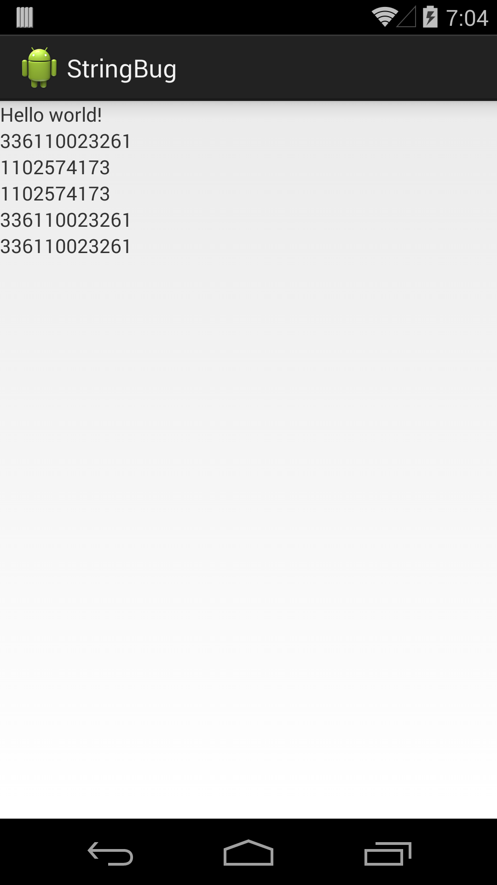

# Reproducible String Resource Bug in Android

> Numbers in string resources are not correctly preserved when defined via `<item type="string">`

This works normally:

    <string name="s1">336110023261</string>

But when defining that string resource with:

    <item name="s2" type="string">336110023261</item>

The value of `s2` becomes `1102574173`.

The main reason this is a problem is because the Gradle `resValue` setting uses the `<item type="string">` syntax.  For instance, given:

    android {
        defaultConfig {
            resValue "string", "s3", "336110023261"
        }
    }

The value of `s3` becomes `1102574173`.

A workaround is to wrap the number in double quotes, like:

    <item name="s4" type="string">"336110023261"</item>

Or with `resValue` in `build.gradle`:

    resValue "string", "s5", "\"336110023261\""

But if you wrap non-numeric strings in double quotes then the double quotes become part of the string.

